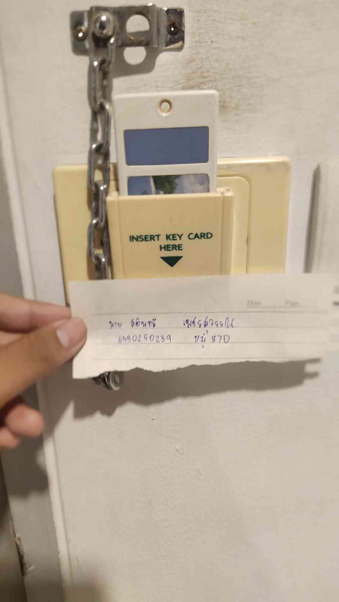

# Example of Security Controls in Daily Life

## Key card ไว้เสียบใช้ไฟในห้อง

__สถานที่ : หอพัก Amber Laemchabang 197/90 หมู่ 8 ตำบลทุ่งสุขลา อำเภอศรีราชา ชลบุรี 20230__

__Control Function: Preventive Control__

__Types of Security Control: Technical Control__

- __การใช้ key card ในการเปิดไฟในห้องเป็น Preventive Control เพราะมันป้องกันการเข้าถึงพื้นที่หรือการใช้งานอุปกรณ์โดยไม่ได้รับอนุญาต หากไม่มี key card ระบบไฟจะไม่ทำงาน ซึ่งเป็นการควบคุมการใช้งานในลักษณะป้องกัน. นอกจากนี้ key card ใช้เทคโนโลยี RFID หรือ Magnetic Stripe ซึ่งเป็น Technical Control ที่ใช้ในการยืนยันตัวตนและอนุญาตการใช้งานเฉพาะผู้ที่มี key card ที่ถูกต้อง.__

### สรุป
   key card ใช้เป็นการควบคุมทางเทคนิคและเชิงป้องกันที่ช่วยป้องกันการเข้าถึงห้องหรือเปิดไฟโดยไม่ได้รับอนุญาต
